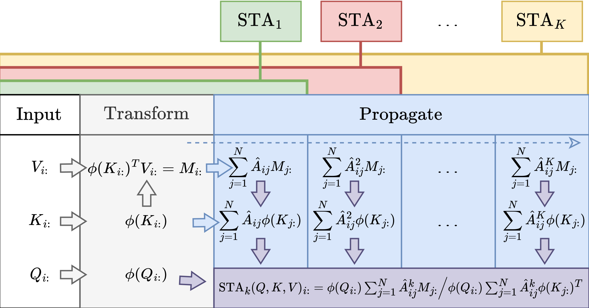

# SubTree Attention Graph Neural Network

Official implementation for "Tailoring Self-Attention for Graph via Rooted Subtrees," accepted as a poster at NeurIPS 2023.

**Related Material:** [Read the paper on arXiv](https://arxiv.org/abs/2310.05296)


## Introduction

Attention mechanisms have made significant strides in graph learning, yet they still exhibit notable limitations: local attention faces challenges in capturing long-range information due to the inherent problems of the message-passing scheme, while global attention cannot reflect the hierarchical neighborhood structure and fails to capture fine-grained local information. In this paper, we propose a novel multi-hop graph attention mechanism, named Subtree Attention (STA), to address the aforementioned issues. STA seamlessly bridges the fully-attentional structure and the rooted subtree, with theoretical proof that STA approximates the global attention under extreme settings. By allowing direct computation of attention weights among multi-hop neighbors, STA mitigates the inherent problems in existing graph attention mechanisms. Further we devise an efficient form for STA by employing kernelized softmax, which yields a linear time complexity. Our resulting GNN architecture, the STAGNN, presents a simple yet performant STA-based graph neural network leveraging a hop-aware attention strategy. Comprehensive evaluations on ten node classification datasets demonstrate that STA-based models outperform existing graph transformers and mainstream GNNs.



## Repository Contents

This repository contains all necessary code to replicate the empirical results presented in our research paper.

**Execution Methods:**
1. **Weights & Biases (WandB)**: Recommended for tracking experiments.
2. **Direct Script Execution**: For immediate local running.

## Dependencies

Ensure your environment is set up with the following versions:

```plaintext
python==3.7.12
pytorch==1.8.0
torch_geometric==2.0.1
torch_sparse==0.6.11
torch_scatter==2.1.1
torch_cluster==1.6.1
torch_spline_conv==1.2.2
wandb==0.12.16
```

## Data Preparation

Unzip `data.zip` into the parent directory as outlined below:

```
parent directory/
├── data/
│   ├── Amazon/
│   ├── Citation_Full/
│   └── ...
└── SubTree-Attention/
    ├── best_params_yamls/
    ├── scripts/
    └── ...
```

## Execution Instructions

### Option 1: Using Provided Scripts

For different datasets, use the respective script files:

- **Datasets**: CiteSeer, Cora, Deezer-Europe, Film
  - **Script**: `scripts/exp_setting_1.sh`
- **Datasets**: Computers, CoraFull, CS, Photo, Physics, Pubmed
  - **Script**: `best_params_yamls/scripts/exp_setting_2.sh`

### Option 2: Using Weights & Biases

1. **Setup**:
   Create `configs` and `remote` folders to store WandB configuration files.
2. **Initiating Sweep**:
   Start a parameter sweep using hyperparameters from `best_params_yamls`. Replace placeholders with your WandB details.
   
   Example command:
   ```bash
   python sweep.py --entity=$YOUR_WANDB_ENTITY$ --project=$YOUR_WANDB_PROJECT$ --source=file --info=best_params_yamls/setting_1/citeseer.yaml
   ```
3. **Initiating Agent**:
   Launch the agent using the received sweep ID and URL. Execute in single or parallel modes as needed:
   
   Single Process:
   ```bash
   python agents.py --entity=$YOUR_WANDB_ENTITY$ --project=$YOUR_WANDB_PROJECT$ --sweep_id=$SWEEP_ID$ --gpu_allocate=$INDEX_GPU$:1 --wandb_base=remote --mode=one-by-one --save_model=False
   ```
   
   Parallel Execution:
   ```bash
   python agents.py --entity=$YOUR_WANDB_ENTITY$ --project=$YOUR_WANDB_PROJECT$ --sweep_id=$SWEEP_ID$ --gpu_allocate=$INDEX_GPU$:$PARALLEL_RUNS$ --wandb_base=temp --mode=parallel --save_model=False
   ```
4. **Results Evaluation**:
   View experiment results at the provided `$SWEEP_URL$` on [wandb.ai](https://wandb.ai).